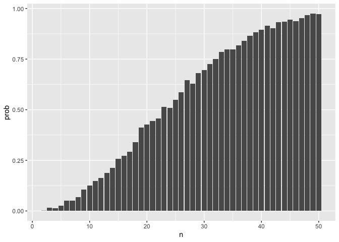
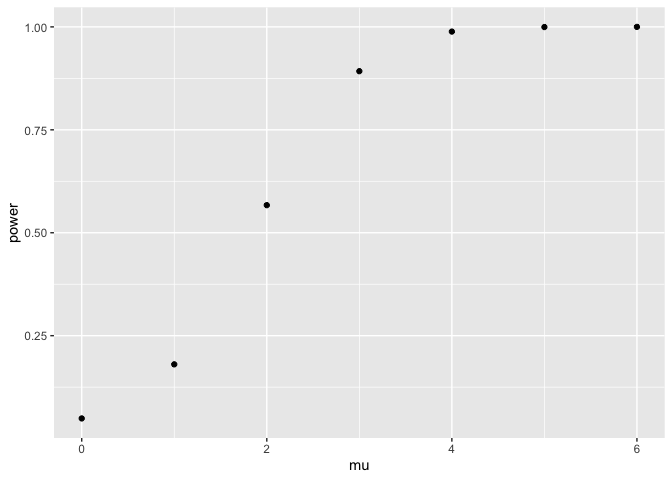
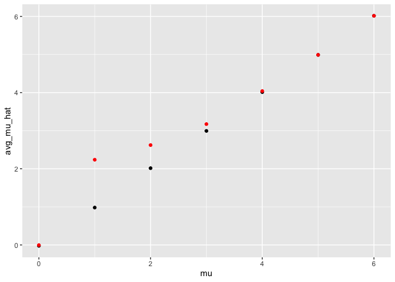
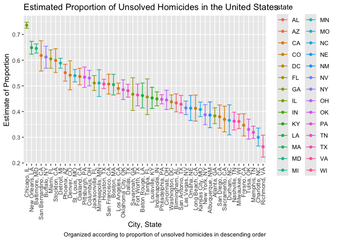

P8105 Homework 5
================
Malika Top
2024-11-15

## Problem 1

``` r
bday_sim = function(n) {
  bdays = sample(1:365, size = n, replace = TRUE)
  duplicate = length(unique(bdays)) < n
  return(duplicate)
}

sim_res =
  expand_grid(
    n = c(2:50),
    iter = 1:1000
  ) |> 
  mutate(res = map_lgl(n, bday_sim)) |> 
  group_by(n) |> 
  summarize(prob = mean(res))

sim_res |> 
  ggplot(aes(x = n, y = prob)) + 
  geom_col()
```

<!-- -->

The probability of having at least one other person share a birthday
increases as the number of people in the group, n, increases. The
probability passes 0.5, when n = 23. Even with n = 50 though, we don’t
get a probability of 1 exactly, but we get very close. If we increase n
to 100, then we would definitely have reached 1 by that point.

## Problem 2

``` r
# Function to get the p-value and estimate for 
sim_power = function(mu) {
  sim_data = 
    tibble(
      x = rnorm(n=30, mean = mu, sd=5), # draw 30 samples from normal distribution w/  
    )                                   # some mean mu and sd = 5
  test_output = t.test(sim_data$x) |>  # conduct a t-test across all samples to see if mu is diff from 0
    broom::tidy() |> 
    select(p.value, estimate)
  return(test_output)
}

sim_res =
  expand_grid(
    iter = 1:5000, # 5000 iterations of drawing 30 samples
    mu = c(0:6)    # for 6 diff. values of mu
  ) |> 
  mutate(power_res = map(mu, \(x) sim_power(x))) |> # conduct t-test for all values of mu 
  unnest(power_res)

sim_res |> 
  group_by(mu) |> 
  summarise(power = mean(p.value < 0.05)) |> # power is the prop. of times we rejected the null
  ggplot(aes(x = mu, y = power)) +
  geom_point()
```

<!-- -->

As the true value of $\mu$ increases (i.e. the effect size), the power
increases. This makes sense because larger differences (larger $\mu$’s)
are easier to detect.

``` r
avg_mu_hat = 
  sim_res |> 
  group_by(mu) |> 
  summarise(avg_mu_hat = mean(estimate))
sig_avg_mu_hat = 
  sim_res |> 
  filter(p.value < 0.05) |> 
  group_by(mu) |> 
  summarise(avg_mu_hat = mean(estimate))
ggplot(avg_mu_hat, aes(x = mu, y = avg_mu_hat)) + 
  geom_point() +
  geom_point(data = sig_avg_mu_hat, aes(x = mu, y = avg_mu_hat), color = "red") +
  labs(color = "Samples where null was rejected")
```

<!-- -->

When we plot the average estimate of $\hat{\mu}$ on the y axis and the
true value of $\mu$ on the x axis, we see that the values are nearly the
exact same (x=y).

However, when we plot the average estimate of $\hat{mu}$ only in samples
for which the null is rejected ( points), we see that they are actually
quite different for values of $\mu \leq 3$. When we select only the
samples where the null was rejected, we will deliberately be choosing
values that are more extreme than the true value of $\mu$, so it makes
sense that the average is not the same, particularly for smaller values
of $\mu$. For $\mu = 1, 2, 3, 4$, we see that the average estimate is in
fact a bit higher than the true value. This is because the more extreme
values of $x$ are what lead us to reject, so then the average estimate
of them will be higher. For $\mu = 5, 6$, we know that for larger effect
sizes, it is easier to reject the null because the difference is more
pronounced. The cutoff value for the sample means for rejection is not
so extreme as it is for smaller true $\mu$, and so it is closer to the
rue values, and less biased.

## Problem 3

``` r
homicide_df = read.csv("data/homicide-data.csv") 
homicide_df[50810, "state"] = "OK"
homicide_df = homicide_df |> 
  mutate(
    state = case_when(
      state == "wI" ~ "WI",
      TRUE ~ state
    )
  ) |> 
  unite("city_state", city:state, remove = FALSE) 
homicide_counts_df = homicide_df |> 
  group_by(city_state, city, state) |> 
  summarise(total_homicide_count = n(),
            unsolved_homicide_count = sum(disposition == "Closed without arrest" | 
                                           disposition == "Open/No arrest")
  ) |> 
  arrange(desc(total_homicide_count))
```

    ## `summarise()` has grouped output by 'city_state', 'city'. You can override
    ## using the `.groups` argument.

After reading in the dataset, we see that one of the observations from
Tulsa, OK, incorrectly has its state coded as AL, so we change that one
value using indices. We also observe that Wisconsin’s abbreviation is
“wI”, so we change that to “WI” to be consistent with the others. The
city with the most total homicide counts was Chicago.

``` r
prop_test = function(x, y) {
  test = prop.test(x, y)
  result = broom::tidy(test) |> 
    select(estimate, conf.low, conf.high)
  return(result)
}

prop_results = 
  homicide_counts_df |> 
  mutate(
    prop_test_res = map2(unsolved_homicide_count, total_homicide_count, prop_test)
  ) |> 
  unnest(prop_test_res)

prop_results = 
  prop_results |> 
  mutate(prop_unsolved = unsolved_homicide_count/total_homicide_count,
         city_state = str_replace(city_state, "_", ", "))

prop_results |> 
  ggplot(aes(x = reorder(city_state, prop_unsolved, decreasing = TRUE), y = estimate,
             color = state)) +
  geom_point() +
  geom_errorbar(aes(ymin = conf.low, ymax = conf.high)) +
  theme(axis.text.x = element_text(angle = 90, vjust = 0.5, hjust=1)) +
  labs(title = "Estimated Proportion of Unsolved Homicides in the United States",
       x = "City, State", y = "Estimate of Proportion",
       caption = "Organized according to proportion of unsolved homicides in descending order")
```

<!-- -->

From the results of `prop.test`, Chicago has the highest estimated
proportion of unsolved homicides, and appears to have the narrowest
confidence interval, which means that there is the least variability
around that estimate. In this plot, I also colored by state since some
states repeat.
